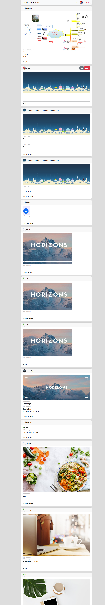

# tarmeez-academy-API_final_big-project
tarmeez-academy-API_final_big-project

this is an API learning project ,trying to prictice API method like (GET, POST, PUT, and DELETE) to (login, logout, register, create, update, delete, create a comment, get All Users, get All Posts For Spacific User,... ) , it contains html,css,Bootstrap5 and Js file.
 
## Table of contents

- [Overview](#overview)
- [Installation](#Installation)
- [Links](#Links)
- [Screenshot](#Screenshot)
- [What I learned](#what-i-learned)
- [helpful links](#helpful-links)
- [Continued development](#continued-development)
- [Author](#author)
- [Acknowledgments](#Acknowledgments)


## overview
this is an API learning project ,trying to prictice API method like (GET, POST, PUT, and DELETE) to (login, logout, register, create, update, delete, create a comment, get All Users, get All Posts For Spacific User,... ) , it contains html,css,Bootstrap5 and Js file.

## Installation
To get started with this project, follow these steps:

you can clone the project or download it as Zip file.
 Clone the repository:
   ```bash
   git clone https://github.com/olahasan/tarmeez-academy-API_final_big-project.git
```

## Links

If you want to open the link in a new tab, you can:

- Press **Ctrl** (or **Cmd** on Mac) while clicking the link.
- Right-click the link and select **Open link in new tab**.

Otherwise, all links will open in the same tab.

- Solution URL: [here](https://github.com/olahasan/tarmeez-academy-API_final_big-project)

- Live Site URL: [here](https://tarmeez-academy-api-final-big-project.netlify.app/)


 ## Screenshot
 



## what-i-learned
Through this project:
- how to make infinite scrolling
- how to add loader while getting data from API  **to see it clearly make Network ->Presets -> 3G**
- how to use pagination
- how to use query params to send data in URL.
- how to deal with postman 
- how to get All Posts , get All Users .
- how to get All Posts For Spacific User after clicked on this post
- how to collect between html,css and Js file.
- how to push it on github + gh-pages and netlify

## helpful-links
- **loader** : (https://loading.io/css/)
- **API** : (https://documenter.getpostman.com/view/4696539/2s83zjqN3F)  **created by [tarmeez academy](https://www.youtube.com/@tarmeez)**

## Continued Development
In the future, I plan to:
- do the same project using JS framework like react . to make it more reusable,avoid duplicate the code, and easy to maintain 

### Author

GitHub - @olahasan
**[olahasan](https://github.com/olahasan)**

### Acknowledgments

I would like to thank the **[tarmeez academy](https://www.youtube.com/@tarmeez)** for providing this challenge and to the community for their support.
